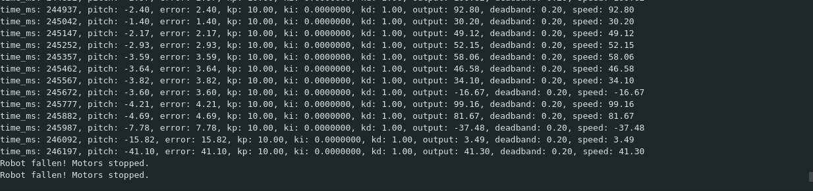

# PID controlled balancing bot 

## Hardware:
- 2x Nema 17 stepper motors
- 2x TB6600 MicroStep Drivers
- MPU6050

## Software:
- AccelStepper
- Kalman Filter
- Wire for I2C

- PID
- Multicore control

## Images:

PID values:
- Kp: 10
- Ki: 0
- Kd: 1
